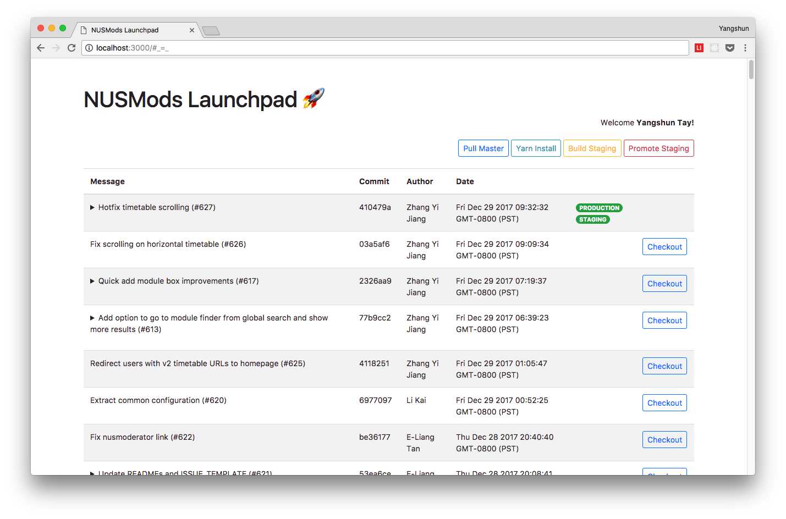

# NUSMods Launchpad

Deployment dashboard for NUSMods - https://launch.nusmods.com



## Installation

```sh
$ git clone https://github.com/nusmodifications/nusmods-launchpad
$ cd nusmods-launchpad
$ yarn
$ cp config.example.js config.js
```

Configure config.js:

1. Create GitHub OAuth app and replace config with app ID and secret.
1. You can also ask for our development ID and secret if you don't want to create one yourself
1. If desired, create Slack app and replace config with API token and target channel IDs.

## Development

```sh
$ yarn start
$ open http://localhost:3000
```

## Deployment

1. Configure nusmods-launchpad.service
1. `sudo systemctl link $PWD/nusmods-launchpad.service`. Assumes \$PWD is on the root file system. See `man systemctl`
1. `sudo systemctl enable nusmods-launchpad.service`
1. `sudo systemctl start nusmods-launchpad.service`

### Maintenance

If you update the nusmods-launchpad.service config file, run `sudo systemctl daemon-reload`.

If NUSMods Launchpad is updated, run `sudo systemctl restart nusmods-launchpad`.

## License

MIT
