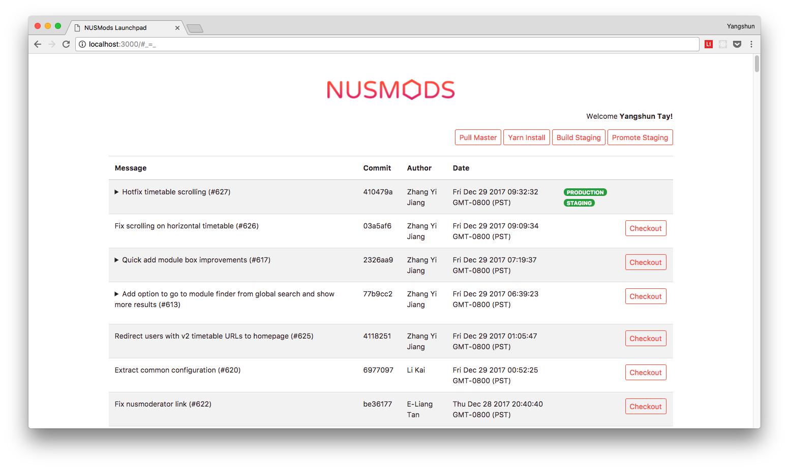

# NUSMods Launchpad

Deployment dashboard for NUSMods - http://launch.nusmods.com



## Installation

```sh
$ yarn
$ cp config.js.example config.js
# Create FB app and replace config with app ID and secret.
$ npm start
$ open http://localhost:3000
```

## Deployment

```sh
$ npm run forever
```

## License

MIT
